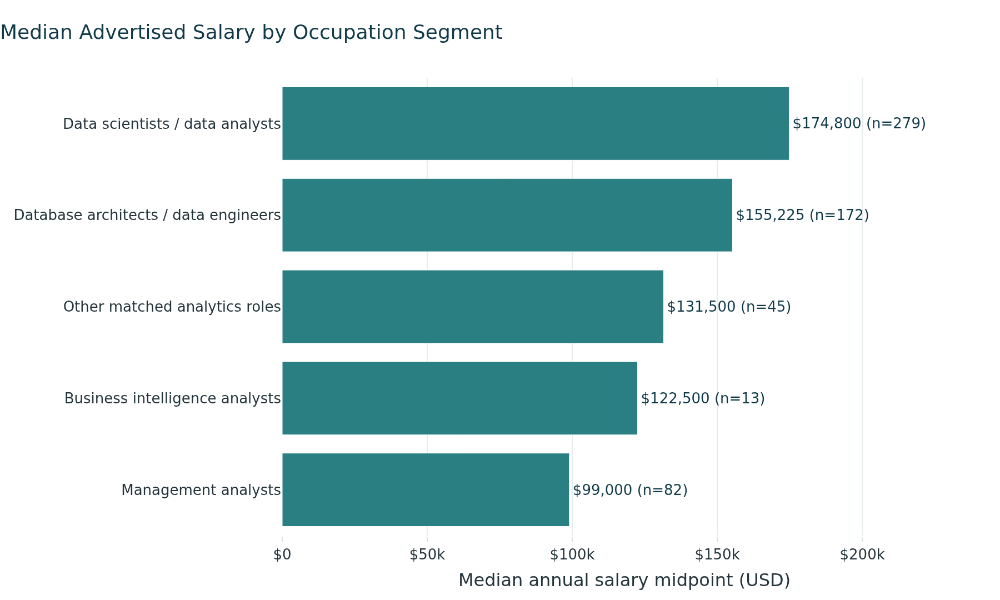
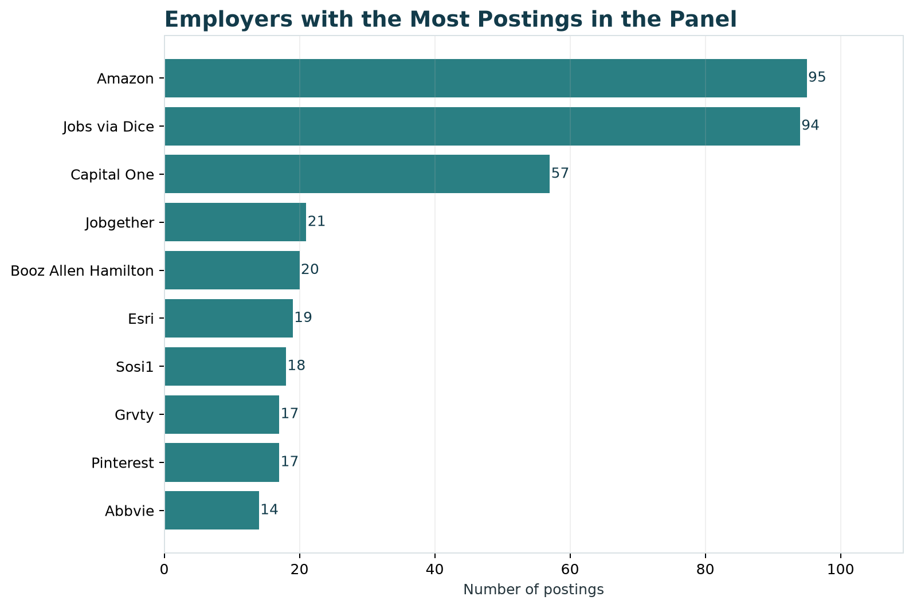

## Purpose

This page gives an overview of the current job market for Data Analytics careers within Computer Systems Design and Related Services.

::: callout-note
## Project Scope

**Industry:** Computer Systems Design and Related Services\
**NAICS code:** 5415\
**Career pathway:** Data Analytics\
**Dates covered:** September 11, 2025-September 10, 2026\
**Final dataset:** 1,790 job postings
:::

## Market Overview

Our cleaned dataset contains 1,790 job postings related to Data Analytics within NAICS 5415. It includes positions in data analysis, data science, data engineering, business analysis, and business intelligence.

These results describe the postings available in the course dataset. They should not be treated as a complete picture of every analytics job in the United States.

### Main Findings

- The final dataset contains 1,790 relevant postings.
- Data Scientists and Database Architects are the two largest occupation groups.
- Salary information is available for 591 postings.
- The median advertised salary midpoint is \$151,475.
- California has the most postings with an identified state.
- Remote and hybrid jobs together account for 41.3% of the dataset.
- Some fields have a large amount of missing or unknown information.

## Job Volume

{#fig-job-volume fig-alt="Horizontal bar chart showing job postings by occupation group."}

### Job-Volume Summary

| Rank | Occupation Group               | Postings | Share |
|-----:|--------------------------------|---------:|------:|
|    1 | Data Scientists                |      769 | 43.0% |
|    2 | Database Architects            |      531 | 29.7% |
|    3 | Management Analysts            |      297 | 16.6% |
|    4 | Other matched analytics roles  |      161 |  9.0% |
|    5 | Business Intelligence Analysts |       32 |  1.8% |

Data Scientists make up the largest group, followed by Database Architects. Together, these two groups account for 72.6% of the dataset.

The occupation names come from the O\*NET classifications in the source data [@onet2026datascientists]. As a result, some positions with titles such as Data Analyst or Data Engineer may be included under a broader occupation group. Job seekers may want to search across several related titles instead of searching only for “Data Analyst.”

## Salary Distribution

{#fig-salary fig-alt="Histogram of annual salary midpoints with the median marked."}

### Salary Summary

| Salary Measure                   |               Result |
|----------------------------------|---------------------:|
| Postings with usable salary data | 591 of 1,790 (33.0%) |
| Median minimum salary            |            \$130,000 |
| Median maximum salary            |            \$170,300 |
| Median salary midpoint           |            \$151,475 |
| 25th-percentile midpoint         |            \$120,000 |
| 75th-percentile midpoint         |            \$187,500 |
| Highest retained midpoint        |            \$340,555 |

Among postings that include salary information, the middle half of salary midpoints falls between \$120,000 and \$187,500. The median midpoint is \$151,475.

Salary information is missing from most of the postings, so these numbers only describe employers that included usable pay information.

### Salary by Occupation Segment

{#fig-salary-role fig-alt="Horizontal bar chart comparing median advertised salary midpoints for occupation groups with at least 10 usable salary observations."}

Among occupation groups with at least 10 postings containing usable salary data, Data Scientists have the highest median advertised salary midpoint at \$174,800, followed by Database Architects at \$155,225. Other matched analytics roles have a median midpoint of \$131,500, Business Intelligence Analysts have a median midpoint of \$122,500, and Management Analysts have a median midpoint of \$99,000.

This comparison includes only occupation groups with at least 10 usable salary observations to avoid drawing conclusions from very small samples. The results are descriptive of postings in this dataset that reported usable salary information and should not be interpreted as salary estimates for all positions in these occupations.

::: callout-warning
## Salary Data Limitation

Hourly pay was converted to an annual amount using 2,080 work hours per year. Zero values were treated as missing, and salaries below \$20,000 were removed as unrealistic. Salary results are based on 591 postings rather than the full dataset.
:::

## Geographic Patterns

{#fig-states fig-alt="Horizontal bar chart showing the states with the most job postings."}

California has the highest number of postings with an identified state, with 258. Virginia follows with 171, New York with 156, and Texas with 132. Washington and the District of Columbia tie for fifth with 70 each.

### Top Identified States

| Rank | State      | Postings | Share of Full Dataset |
|-----:|------------|---------:|----------------------:|
|    1 | California |      258 |                 14.4% |
|    2 | Virginia   |      171 |                  9.6% |
|    3 | New York   |      156 |                  8.7% |
|    4 | Texas      |      132 |                  7.4% |
|    5 | Washington |       70 |                  3.9% |
|    5 | District of Columbia |       70 |                  3.9% |

The postings are spread across several major technology and business markets. However, 377 postings do not have an identifiable state. The state results therefore show where the known locations are concentrated, not the location of every job in the dataset.

## Experience and Education

Minimum experience information is available for 520 of the 1,790 postings (29.1%). Among postings with usable minimum-experience information, the median minimum requirement is 5 years.

{#fig-experience fig-alt="Bar chart showing minimum years of experience requested across five bands, with five to seven years the largest group."}

### Experience Distribution

| Minimum Experience | Postings | Share of Postings with Data |
|--------------------|---------:|----------------------------:|
| 1-2 years          |      102 |                       19.6% |
| 3-4 years          |      137 |                       26.3% |
| 5-7 years          |      188 |                       36.2% |
| 8-10 years         |       73 |                       14.0% |
| More than 10 years |       20 |                        3.8% |

The largest group asks for five to seven years. Only 102 of the 520 postings with usable experience data request two years or less, which is 19.6% of that subset. For a student or early-career candidate, this suggests that most advertised roles in this industry are not entry-level, and that the postings open to less experience are a small share of the market.

Shares in this table are calculated against the 520 postings that state a requirement, not against the full dataset.

### Education Distribution

| Highest Education Level Listed      | Postings | Share |
|-------------------------------------|---------:|------:|
| Bachelor's degree                   |      615 | 34.4% |
| Master's degree                     |      385 | 21.5% |
| High school diploma or equivalent   |      308 | 17.2% |
| Doctoral or professional degree     |      176 |  9.8% |
| Associate's degree                  |       53 |  3.0% |
| Missing or not specified            |      253 | 14.1% |

Bachelor's and master's degree categories together account for 55.9% of the full dataset. Education information is missing or not specified for 253 postings.

The education fields appear to be standardized or modeled values. They may not represent an education requirement written directly by each employer.

::: callout-warning
## Limited Experience Information

We did not treat missing experience as zero years of experience. Minimum-experience information is available for 520 postings, so the experience findings describe only the subset of postings with usable experience data.
:::

## Remote, Hybrid, and On-site Work

{#fig-work-arrangement fig-alt="Bar chart comparing remote, hybrid, on-site, and unknown work arrangements."}

| Work Arrangement         | Postings | Share |
|--------------------------|---------:|------:|
| Remote                   |      362 | 20.2% |
| Hybrid                   |      378 | 21.1% |
| On-site                  |      120 |  6.7% |
| Unknown or not specified |      930 | 52.0% |

Remote and hybrid jobs together account for 740 postings, or 41.3% of the dataset. However, the work arrangement is unknown for 930 postings.

The Unknown category should not be counted as on-site work. It only means that the source did not provide a usable classification.

## Top Employers

{#fig-employers fig-alt="Horizontal bar chart showing the employers with the most postings."}

### Employers with the Most Postings

| Rank | Employer            | Postings |
|-----:|---------------------|---------:|
| 1    | Amazon              |       95 |
| 2    | Jobs via Dice       |       94 |
| 3    | Capital One         |       57 |
| 4    | Jobgether           |       21 |
| 5    | Booz Allen Hamilton |       20 |
| 6    | Esri                |       19 |

Amazon has the highest number of postings in the dataset, closely followed by Jobs via Dice, with Capital One as the third-largest employer label.

Employer names are not fully consistent. For example, Turnitin and Turnitinllc appear as separate labels even though they may represent the same company. The employer counts provide a general picture of hiring activity, but they may undercount companies that appear under more than one name.

## What This Means for Job Seekers

Job seekers should search across several related titles, including Data Analyst, Data Scientist, Data Engineer, Business Analyst, and Business Intelligence Analyst. Searching only for one title could leave out relevant opportunities.

California has the most postings with a known state, but the data also shows opportunities in Virginia, New York, Texas, Washington, and remote positions.

Candidates may also benefit from showing a mix of technical and business skills. Employers may expect candidates to analyze data, prepare or manage data, explain findings, and connect their work to business needs.

## Limitations

- The dataset contains 1,790 selected postings and does not represent the entire U.S. job market.
- Salary information is available for only 591 postings.
- Minimum-experience information is available for only 520 postings, so experience findings are based on a subset of the dataset.
- State information is unavailable for 377 postings.
- Work arrangement is unknown for 930 postings.
- Employer names are not fully standardized.
- The analysis covers postings dated September 11, 2025 through September 10, 2026 and does not represent periods outside that window.

## Job Market Snapshot

:::: {.metric-grid}

::: {.metric-card}
### Job Postings

1,790

Relevant postings within NAICS 5415
:::

::: {.metric-card}
### Median Salary

$151,475

Based on 591 postings with usable salary data
:::

::: {.metric-card}
### Remote or Hybrid

41.3%

740 postings classified as remote or hybrid
:::

::::

## Reproducing the Results

The figures and data dictionary were created from `data/processed/career_market_panel.csv` by `scripts/build_market_baseline.py`. All charts use the team's shared Plotly theme (`scripts/plot_theme.py`) and are saved as static images in `figures/` so the site renders reliably on GitHub Pages.

To rebuild them, run `python scripts/build_market_baseline.py` from the repository root.

## References

::: {#refs}
:::
