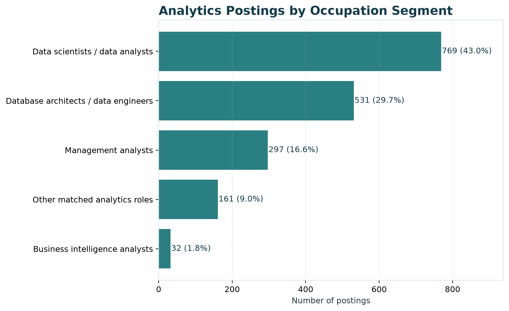
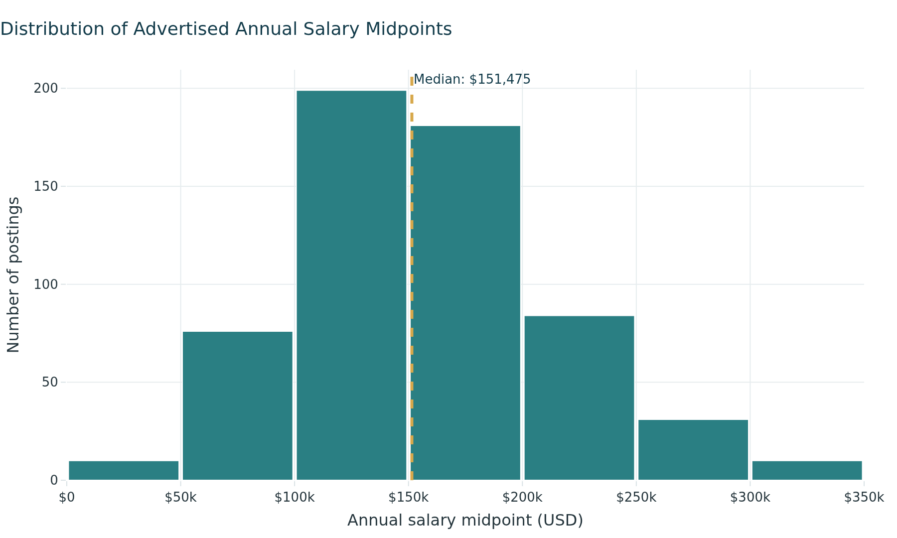
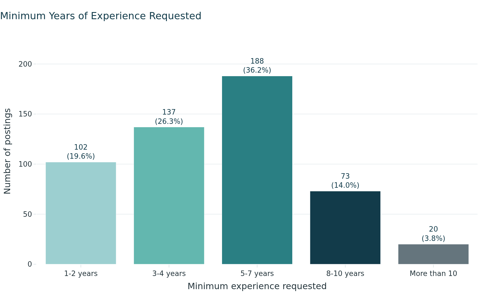
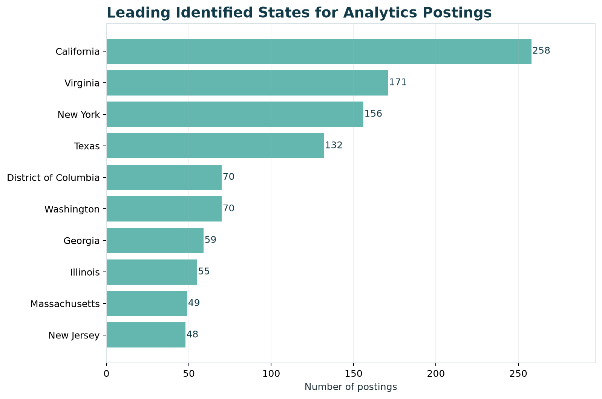
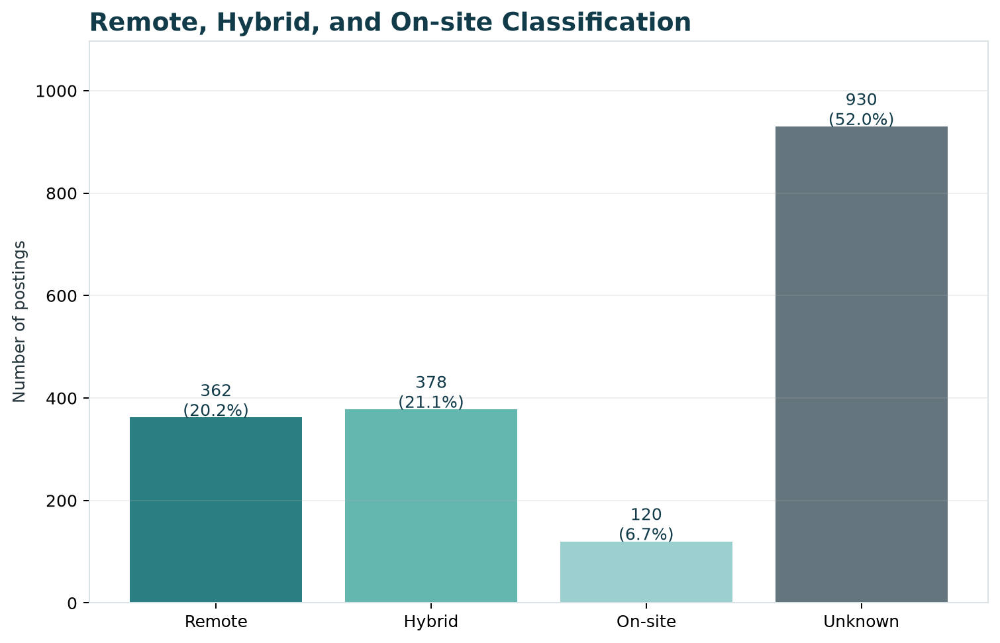
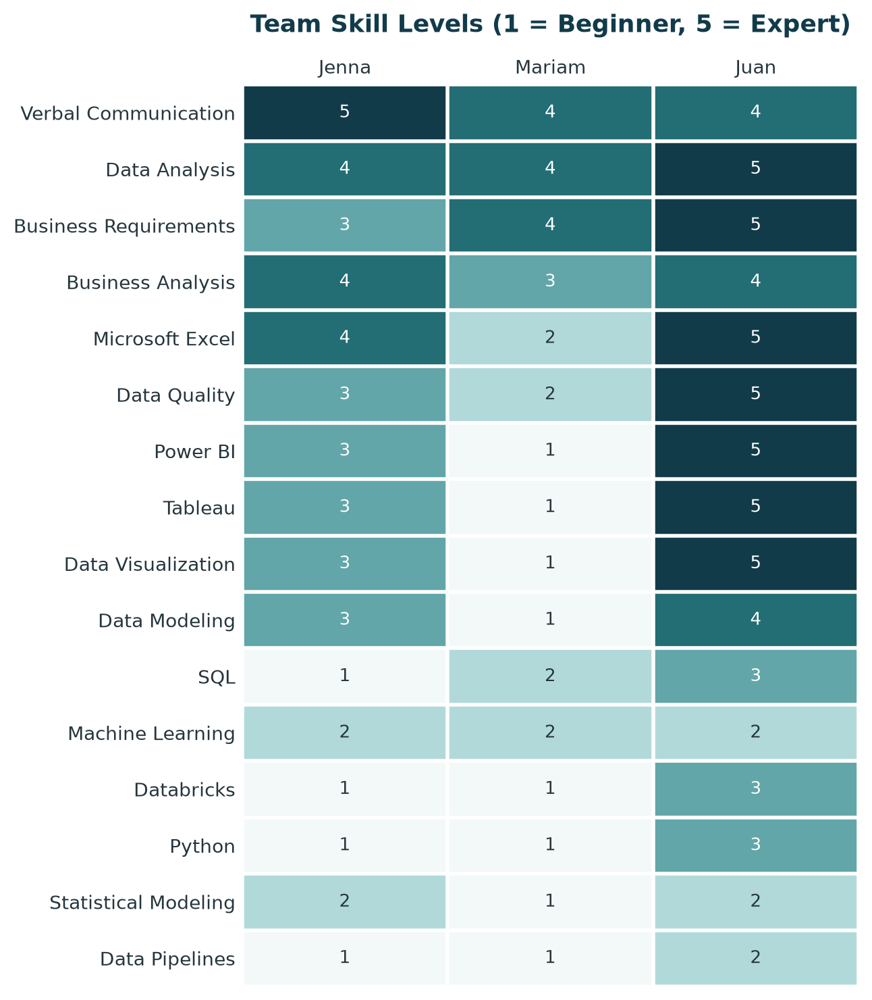
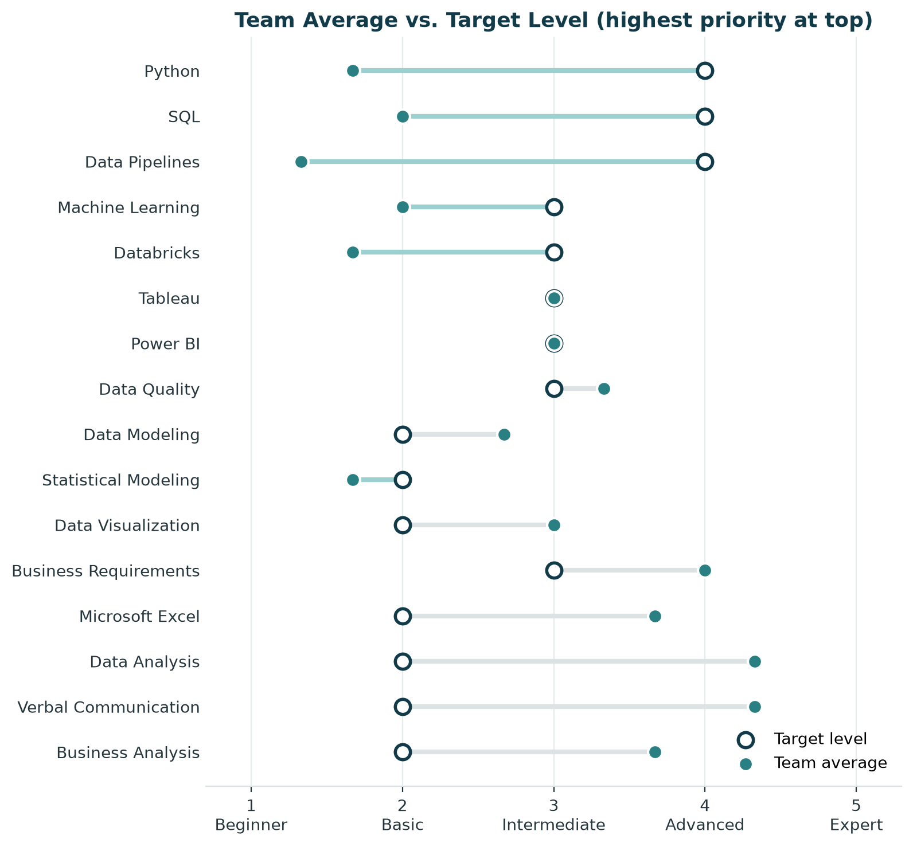
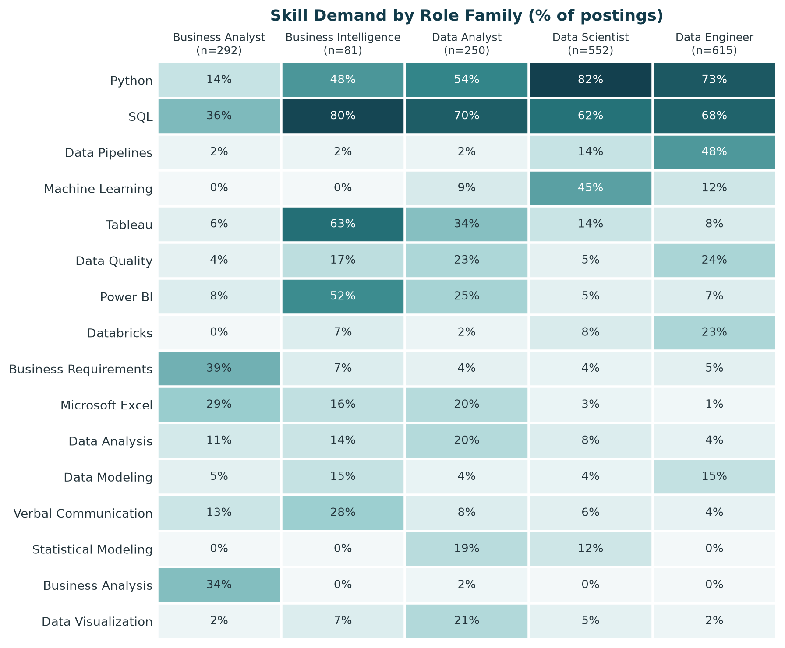
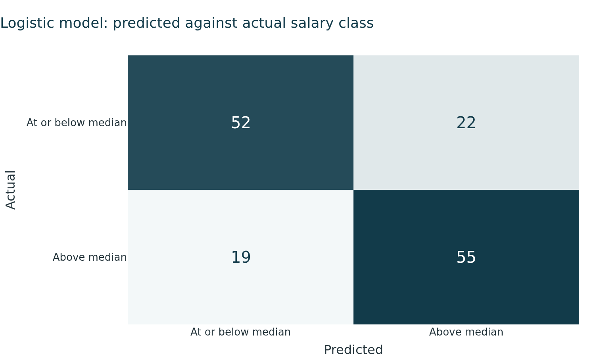
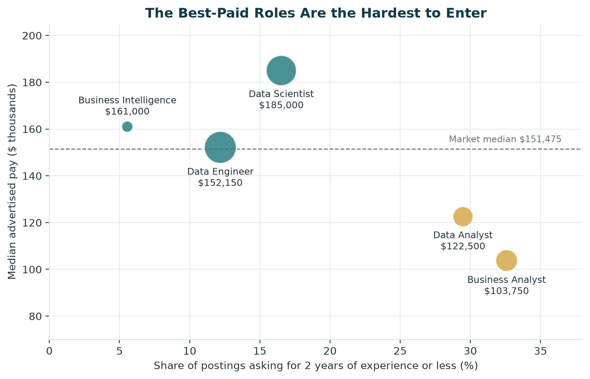

```{python}
#| label: setup
import json
import pandas as pd

stats = json.load(open("data/processed/panel_build_stats.json"))
metrics = pd.read_csv("data/processed/model_metrics.csv")

def md_table(df):
    # Pipe table so the table renders natively in Word
    cols = [str(c) for c in df.columns]
    # Dash counts set relative column widths in Word; the first column gets more room
    weights = [32, 14, 14, 14, 13, 13] if len(cols) == 6 else [50] * len(cols)
    seps = ["-" * w for w in weights]
    lines = ["| " + " | ".join(cols) + " |", "|" + "|".join(seps) + "|"]
    for row in df.itertuples(index=False):
        lines.append("| " + " | ".join(str(v) for v in row) + " |")
    print("\n".join(lines))
```

**Project website:** <https://jennader.github.io/METAD688_Group2/>  
**GitHub repository:** <https://github.com/JennaDer/METAD688_Group2>

# Product Framing

This project evaluates career opportunities for aspiring data analytics professionals within the U.S. Computer Systems Design and Related Services industry (NAICS 5415) [@census2022naics5415]. The target user is a student, recent graduate, or early-career professional deciding which analytics roles to pursue and which skills to prioritize.

> **How can an aspiring analytics professional evaluate career opportunities in Computer Systems Design and Related Services and determine which skills, qualifications, and experiences to prioritize to become a competitive candidate?**

To answer this question, the project combines labor-market analysis, skill-gap analysis, and predictive modeling. We examine the volume and characteristics of analytics-related job postings, compare employer demand with the current skills of our team members, and evaluate which job characteristics are associated with higher advertised salaries.

The final product is designed as a decision-support tool rather than simply a description of the job market. It translates the analysis into practical recommendations about target roles, technical skills, job-search strategy, and longer-term career development.

# Scope and Data

The analysis uses the MET CareerCompass 2026 v2 job-postings extract provided for the course. The source contains 21 Parquet files with 504,208 job postings and 124 variables. We focus on Computer Systems Design and Related Services (NAICS 5415) and analytics-related roles, including Data Analyst, Data Scientist, Data Engineer, Business Intelligence, and Business Analyst positions.

The project was originally scoped to Pharmaceutical and Medicine Manufacturing (NAICS 3254). However, an initial volume check showed that the industry contained too few relevant analytics postings to support a meaningful market analysis. The team therefore shifted to NAICS 5415, which provided a substantially larger pool of analytics opportunities.

The dataset was also updated during the project. Module 2 used an earlier extract that contained 165,386 postings but had incomplete skill and experience fields. In particular, many skill names, including Python and SQL, were missing, and the experience fields were blank. Beginning in Module 3, the analysis was rebuilt using the corrected v2 extract.

The analytical panel was created in PySpark. We first filtered the source to NAICS 5415 and then identified analytics roles using title patterns for data analysis, data science, data engineering, business intelligence, and business analysis. Titles associated with unrelated areas such as security, quality assurance, support, and networking were excluded. To represent the current labor market, we retained postings from the most recent 12-month period in the dataset, September 11, 2025 through September 10, 2026. The resulting panel contains 1,790 job postings (@tbl-funnel).

```{python}
#| label: tbl-funnel
#| tbl-cap: "Postings remaining after each filtering step."
#| output: asis
steps = [
    ("Raw extract", stats["raw_postings"]),
    (f"NAICS {stats['industry_code']} filter", stats["industry_postings"]),
    ("Analytics title patterns included", stats["after_role_include"]),
    ("Unrelated title patterns excluded", stats["after_role_exclude"]),
    ("Most recent 12 months", stats["after_window"]),
]
md_table(pd.DataFrame(
    {"Step": [a for a, _ in steps], "Postings": [f"{b:,}" for _, b in steps]}
))
```

Several additional cleaning decisions were made before analysis. Salary values of zero and implausibly low annual salaries were treated as missing, while hourly and daily rates were converted to annual equivalents. Minimum-experience values of zero were treated as unspecified because they did not consistently represent entry-level positions. Each posting retained in the panel has a unique ID; apparent repeats by title, employer, and date were kept because some represented the same role advertised across multiple locations.

The cleaned analytical panel was saved as `data/processed/career_market_panel.csv` and used consistently across the market, skill-gap, and predictive-modeling analyses.

# Market Baseline

The final analytical panel contains 1,790 analytics-related job postings within NAICS 5415. Data Scientists represent the largest occupation group with 769 postings (43.0%), followed by Database Architects with 531 (29.7%). Together, these two groups account for 72.6% of the panel. Because the source uses O\*NET classifications [@onet2026datascientists], job titles such as Data Analyst or Data Engineer may appear within broader occupation groups, reinforcing the importance of searching across related titles rather than relying on a single title (@fig-volume).

{#fig-volume width="6in"}

Salary information is available for 591 postings, or 33.0% of the panel. Among postings with usable salary data, the median advertised salary midpoint is \$151,475, with the middle 50% ranging from \$120,000 to \$187,500. Data Scientists have the highest median midpoint among the major occupation groups at \$174,800, followed by Database Architects at \$155,225. These salary results describe only postings that disclose usable pay and should not be interpreted as salary estimates for the entire market (@fig-salary).

{#fig-salary width="6in"}

The market also shows a meaningful experience barrier for early-career candidates. Minimum-experience information is available for 520 postings, with a median requirement of five years. Only 102 of those postings, or 19.6%, request two years of experience or less. This suggests that although demand for analytics professionals is substantial, a relatively small portion of postings with stated experience requirements are clearly accessible to candidates at the beginning of their careers (@fig-experience).

{#fig-experience width="6in"}

Geographically, California has the largest number of postings with an identified state at 258, followed by Virginia, New York, and Texas, with Washington and the District of Columbia tied for fifth at 70 each. Flexible work is also significant: 362 postings are classified as remote and 378 as hybrid, together representing 41.3% of the full panel. However, work arrangement is unknown for 930 postings, so the flexible-work share should be interpreted cautiously (@fig-states and @fig-remote).

{#fig-states width="6in"}

{#fig-remote width="6in"}

Overall, the baseline shows a large but experience-intensive analytics market with strong advertised salaries and opportunities distributed across several role families, locations, and work arrangements. For an early-career job seeker, the findings suggest that role accessibility and required skills need to be considered alongside salary and overall job volume.

# Skill-Gap Analysis

The skill-gap analysis compares the capabilities employers request with the team's current skill profile to identify the areas that would most improve career readiness. Using the corrected v2 skill taxonomy, the analysis measures demand for technical and business skills across the 1,790-posting analytical panel and compares that demand with the team's self-assessed proficiency levels. Skills are measured at the posting level, consistent with prior research using analytics job advertisements to compare skill requirements across related roles [@verma2019skills].

Across the full market, Python and SQL are the most frequently requested technical skills, each appearing in more than 60% of postings. Other recurring technical capabilities include data pipelines, data engineering, Databricks, machine learning, Tableau, and Power BI. The team is generally stronger in business-oriented capabilities, including data analysis, business analysis, business requirements, Excel, and communication, while the larger gaps are concentrated in technical skills (@fig-heatmap).

{#fig-heatmap width="6in"}

To make the comparison systematic, market demand was translated into target proficiency levels. Skills appearing in at least 20% of postings were assigned an Advanced target, those appearing in 10% to 19.9% an Intermediate target, and those appearing in less than 10% a Basic Knowledge target. A skill gap represents the difference between this market-based target and the team's current self-assessed proficiency. The resulting priority score combines the average team gap with the share of postings requesting the skill, giving greater weight to skills that are both widely requested and currently underdeveloped (@fig-gap).

{#fig-gap width="6in"}

The analysis identifies Python and SQL as the team's most important overall development priorities. Data pipelines also represent a substantial gap relative to demand, particularly for more technical pathways. In contrast, the team's existing business capabilities generally meet the market-based targets, providing a useful foundation for analyst- and business-oriented positions.

The role-specific analysis also shows why development priorities should not be based on overall market demand alone. Business Intelligence positions emphasize SQL along with visualization tools such as Tableau and Power BI. Business Analyst positions place greater emphasis on SQL, business requirements, business analysis, and Excel, with Python appearing less frequently. Data Scientist positions place much greater emphasis on Python and machine learning, while Data Engineer positions emphasize Python, SQL, and data pipelines (@fig-role-demand).

{#fig-role-demand width="6in"}

These findings suggest that there is no single skill-development plan that is equally appropriate for every analytics pathway. SQL offers the broadest value across the roles examined, while additional priorities should depend on the type of position a job seeker intends to pursue. The team's existing business strengths can support analyst-oriented pathways, whereas more technical pathways require deeper development in programming, machine learning, data engineering, or related tools.

# Final Analytics

The final analysis moves beyond describing the labor market to evaluate which characteristics of a job posting are associated with higher advertised pay. A binary classification approach was used to predict whether a posting's salary midpoint falls above or at/below the median salary among postings with usable compensation data. This framing provides a practical signal for job seekers while avoiding the uncertainty associated with predicting an exact salary from a relatively small salary-reporting sample.

The models use information visible to a job seeker in the posting itself: role family, work arrangement, state, education level, and listed skills. Minimum years of experience was excluded because it was available for too few salary-reporting postings, while the staffing-agency indicator had too few positive cases to support reliable estimation. Occupation group was also excluded because it overlaps conceptually with the role-family classification.

Model performance was evaluated using a 75/25 stratified train-test split. Five-fold cross-validation was conducted within the training set, and the held-out test set was evaluated only after model selection. Four specifications were compared: a majority-class baseline, logistic regression using role family only, logistic regression using all available features, and a random forest using the full feature set. This design allows the analysis to test not only predictive performance but also whether information beyond job title adds useful evidence. @tbl-metrics reports the results for all four specifications.

```{python}
#| label: tbl-metrics
#| tbl-cap: "Model performance. Cross-validation accuracy is measured inside the training set; test figures come from the single held-out evaluation."
#| output: asis
m = metrics.copy()
for c in ["cv_accuracy_mean", "test_accuracy", "test_precision", "test_recall", "test_f1"]:
    m[c] = (m[c] * 100).map("{:.1f}%".format)
m["model"] = m["model"].replace({
    "Logistic, role family only": "Logistic, role family only (5 features)",
    "Logistic, all features": "Logistic, all 55 features",
    "Random forest, all features": "Random forest, all 55 features",
})
md_table(m[["model", "cv_accuracy_mean", "test_accuracy", "test_precision", "test_recall", "test_f1"]]
         .set_axis(["Model", "CV accuracy", "Test accuracy", "Precision", "Recall", "F1"], axis=1))
```

The results show that role family alone is a relatively weak predictor of whether a posting pays above the market median. Adding location, education, work arrangement, and skills substantially improves predictive performance, demonstrating that job title alone does not capture much of the information associated with compensation. The random forest achieved the strongest test performance, while the logistic model was retained alongside it because its coefficients provide a more interpretable view of the factors associated with higher or lower pay (@fig-confusion).

{#fig-confusion width="6in"}

The two models provide complementary evidence about what separates higher-paying postings. The random forest places greater importance on broad structural characteristics such as state and role family, while the logistic model gives greater weight to individual skills. California is particularly important as a structural factor, appearing as the strongest positive non-skill feature in the logistic model and the most important feature in the random forest (@fig-features).

{#fig-features width="6in"}

The skill results also show that frequency and compensation value are not the same. Statistical Modeling appears in relatively few postings but is associated with substantially higher advertised salary in this sample. Its median salary is \$211,200 among postings listing the skill compared with \$148,100 among postings without it. By contrast, postings listing Power BI and PostgreSQL have lower median salaries than postings without those skills in the salary-reporting sample. These findings do not imply that acquiring a particular skill causes salary to rise or fall; they show associations within this industry and dataset.

In practical career terms, the model adds an important dimension to the earlier skill-gap analysis. Skill frequency remains useful for understanding what employers commonly request and what may help a candidate qualify for more openings. The predictive analysis provides a separate signal about which characteristics are associated with higher-paying opportunities. A job seeker should therefore consider accessibility, market demand, skill fit, location, and compensation together rather than assuming that the most frequently requested skill or a particular job title necessarily leads to the strongest opportunity.

# Recommendations

The combined market, skill-gap, and predictive analyses support five recommendations for students, recent graduates, and early-career professionals pursuing analytics careers in Computer Systems Design and Related Services.

**1. Use Business Analyst and Data Analyst roles as practical entry points.** The highest-paying technical roles are also among the least accessible to candidates with limited experience. Business Analyst and Data Analyst postings offer a better balance of accessibility and relevant skill requirements, making them reasonable first targets before progressing toward Data Scientist, Data Engineer, or Business Intelligence positions (@fig-pay-access).

{#fig-pay-access width="6in"}

**2. Prioritize SQL first, followed by Python according to the target role.** SQL appears across every role family examined and therefore provides the broadest immediate value. Python is also highly demanded but is considerably more important for technical pathways such as Data Science than for Business Analyst positions. Candidates should therefore develop SQL as a foundation and adjust the depth of their Python training to the roles they intend to pursue.

**3. Separate skills that improve access from skills associated with higher pay.** Frequently requested skills help candidates qualify for a larger number of openings, but frequency alone does not indicate compensation potential. Statistical Modeling is requested less often than several other technical skills but shows a strong positive association with higher advertised pay in the modeling sample. Candidates can therefore use common skills such as SQL and Python to build market access and then deepen more specialized analytical capabilities as they progress.

**4. Search across related titles and evaluate the skills within each posting.** Job title alone provides limited information about compensation and can obscure overlap among analytics occupations. Candidates should search across Data Analyst, Business Analyst, Business Intelligence Analyst, Data Scientist, and Data Engineer titles while evaluating the actual skill requirements of each opportunity.

**5. Consider location and work arrangement as part of the opportunity decision.** Location remains strongly associated with advertised compensation, with California standing out in the predictive analysis. Candidates who can relocate should consider geographic pay differences alongside factors such as cost of living, which is not captured in this dataset. Candidates who cannot relocate should include remote and hybrid positions in their search because flexible arrangements represent a substantial portion of the market and the analysis does not show an obvious advertised-pay penalty for them.

Taken together, these recommendations suggest a staged career strategy: enter through an accessible analytics role, build broadly transferable technical skills, develop specialized analytical capabilities over time, and evaluate opportunities using a combination of role accessibility, skill fit, compensation, location, and work arrangement rather than any single factor.

# Limitations

Several limitations should be considered when interpreting the findings and recommendations. First, salary information is available for only a subset of the 1,790 postings, so compensation findings describe employers that disclose usable pay and may not represent the full market. Minimum-experience information is also missing from many postings, meaning that conclusions about early-career accessibility are based only on positions that explicitly state an experience requirement.

Some findings rely on relatively small subgroups. Business Intelligence represents a comparatively small role family, and the positive association between Statistical Modeling and advertised pay is based on a limited number of salary-reporting postings. These results should therefore be interpreted as directional rather than definitive.

The predictive analysis identifies associations rather than causal relationships. A skill, location, or other posting characteristic associated with higher advertised pay does not establish that acquiring that skill or moving to that location would cause an individual's salary to increase. Similarly, the skill data does not distinguish between required and preferred qualifications.

The dataset contains job advertisements rather than hiring outcomes. It shows what employers request and advertise, but not which candidates are ultimately hired, the compensation they accept, or how their careers progress after entering a role. Geographic salary differences are also not adjusted for cost of living.

Finally, the analysis is limited to analytics-related positions within Computer Systems Design and Related Services (NAICS 5415) during the September 11, 2025 through September 10, 2026 period. The findings should not automatically be generalized to other industries, occupations, or time periods.

# References {.unnumbered}

:::: {#refs}
::: {}
:::
::::