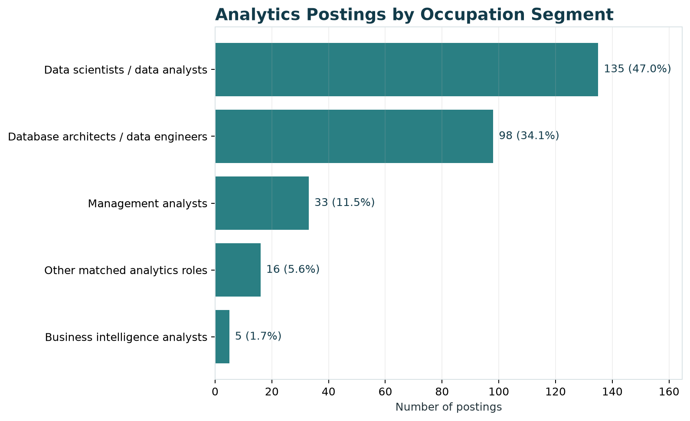
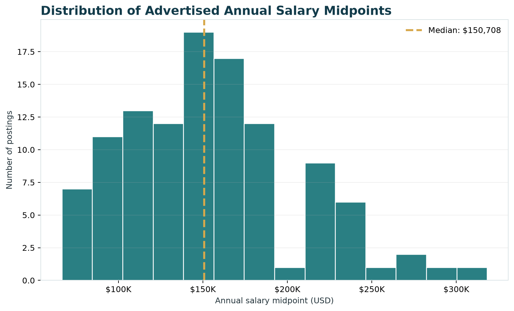
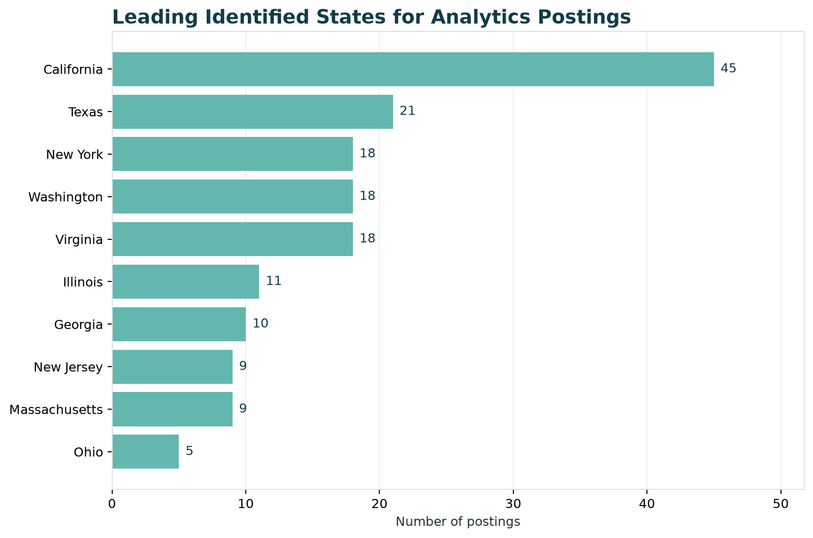
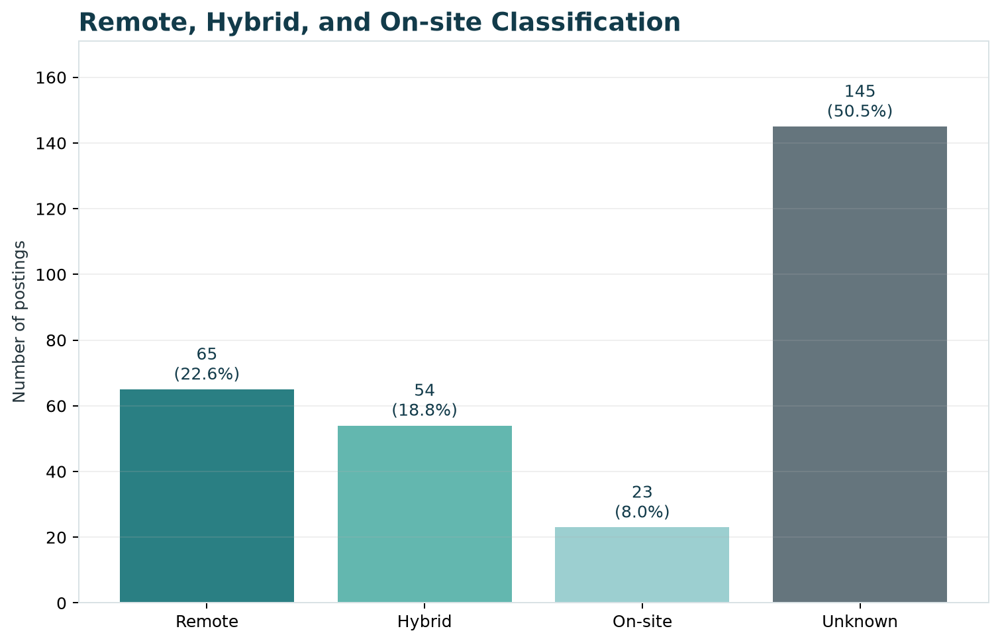
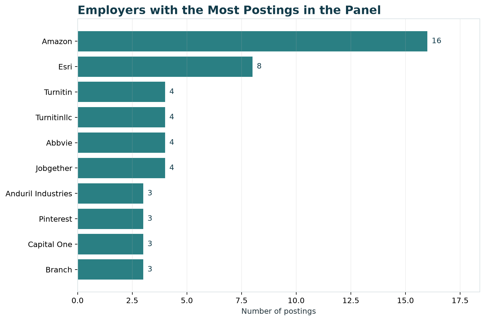

## Purpose

This page gives an overview of the current job market for Data Analytics careers within Computer Systems Design and Related Services.

::: {.callout-note}
## Project Scope

**Industry:** Computer Systems Design and Related Services  
**NAICS code:** 5415  
**Career pathway:** Data Analytics  
**Dates covered:** March 25, 2026–June 29, 2026  
**Final dataset:** 287 job postings
:::

## Market Overview

Our cleaned dataset contains 287 job postings related to Data Analytics within NAICS 5415. It includes positions in data analysis, data science, data engineering, business analysis, and business intelligence.

These results describe the postings available in the course dataset. They should not be treated as a complete picture of every analytics job in the United States.

### Main Findings

- The final dataset contains 287 relevant postings.
- Data Scientists and Database Architects are the two largest occupation groups.
- Salary information is available for 112 postings.
- The median advertised salary midpoint is $150,708.
- California has the most postings with an identified state.
- Remote and hybrid jobs together account for 41.5% of the dataset.
- Some fields have a large amount of missing or unknown information.

## Job Volume

{#fig-job-volume fig-alt="Horizontal bar chart showing job postings by occupation group."}

### Job-Volume Summary

| Rank | Occupation Group | Postings | Share |
|---:|---|---:|---:|
| 1 | Data Scientists | 135 | 47.0% |
| 2 | Database Architects | 98 | 34.1% |
| 3 | Management Analysts | 33 | 11.5% |
| 4 | Other matched analytics roles | 16 | 5.6% |
| 5 | Business Intelligence Analysts | 5 | 1.7% |

Data Scientists make up the largest group, followed by Database Architects. Together, these two groups account for 81.1% of the dataset.

The occupation names come from the O\*NET classifications in the source data. As a result, some positions with titles such as Data Analyst or Data Engineer may be included under a broader occupation group. Job seekers may want to search across several related titles instead of searching only for “Data Analyst.”

## Salary Distribution

{#fig-salary fig-alt="Histogram of annual salary midpoints with the median marked."}

### Salary Summary

| Salary Measure | Result |
|---|---:|
| Postings with usable salary data | 112 of 287 (39.0%) |
| Median minimum salary | $125,000 |
| Median maximum salary | $173,000 |
| Median salary midpoint | $150,708 |
| 25th-percentile midpoint | $120,000 |
| 75th-percentile midpoint | $180,000 |
| Highest retained midpoint | $318,250 |

Among postings that include salary information, the middle half of salary midpoints falls between $120,000 and $180,000. The median midpoint is $150,708.

Salary information is missing from most of the postings, so these numbers only describe employers that included usable pay information.

::: {.callout-warning}
## Salary Data Limitation

Hourly pay was converted to an annual amount using 2,080 work hours per year. Zero values were treated as missing, and salaries below $20,000 were removed as unrealistic. Salary results are based on 112 postings rather than the full dataset.
:::

## Geographic Patterns

{#fig-states fig-alt="Horizontal bar chart showing the states with the most job postings."}

California has the highest number of postings with an identified state, with 45. Texas follows with 21. Washington, New York, and Virginia each have 18.

### Top Identified States

| Rank | State | Postings | Share of Full Dataset |
|---:|---|---:|---:|
| 1 | California | 45 | 15.7% |
| 2 | Texas | 21 | 7.3% |
| 3 | Washington | 18 | 6.3% |
| 3 | New York | 18 | 6.3% |
| 3 | Virginia | 18 | 6.3% |

The postings are spread across several major technology and business markets. However, 82 postings do not have an identifiable state. The state results therefore show where the known locations are concentrated, not the location of every job in the dataset.

## Experience and Education

The course dataset includes minimum and maximum experience fields, but both are blank across all 165,386 original records. This means we cannot create a reliable experience distribution.

Instead, we report education as the available qualification measure.

### Education Distribution

| Highest Education Level Listed | Postings | Share |
|---|---:|---:|
| Master's degree | 101 | 35.2% |
| Bachelor's degree | 94 | 32.8% |
| Associate's degree | 48 | 16.7% |
| Doctoral or professional degree | 44 | 15.3% |

Bachelor's and master's degree categories together account for 68.0% of the education values in the final dataset.

The education fields appear to be standardized or modeled values. They may not represent an education requirement written directly by each employer.

::: {.callout-warning}
## Missing Experience Information

We did not treat missing experience as zero years of experience. The source data does not provide enough information to determine how much experience employers require.
:::

## Remote, Hybrid, and On-site Work

{#fig-work-arrangement fig-alt="Bar chart comparing remote, hybrid, on-site, and unknown work arrangements."}

| Work Arrangement | Postings | Share |
|---|---:|---:|
| Remote | 65 | 22.6% |
| Hybrid | 54 | 18.8% |
| On-site | 23 | 8.0% |
| Unknown or not specified | 145 | 50.5% |

Remote and hybrid jobs together account for 119 postings, or 41.5% of the dataset. However, the work arrangement is unknown for 145 postings.

The Unknown category should not be counted as on-site work. It only means that the source did not provide a usable classification.

## Top Employers

{#fig-employers fig-alt="Horizontal bar chart showing the employers with the most postings."}

### Employers with the Most Postings

| Rank | Employer Label | Postings |
|---:|---|---:|
| 1 | Amazon | 16 |
| 2 | Esri | 8 |
| 3 | Turnitin | 4 |
| 3 | Turnitinllc | 4 |
| 3 | Abbvie | 4 |
| 3 | Jobgether | 4 |

Amazon has the highest number of postings in the dataset, followed by Esri.

Employer names are not fully consistent. For example, Turnitin and Turnitinllc appear as separate labels even though they may represent the same company. The employer counts provide a general picture of hiring activity, but they may undercount companies that appear under more than one name.

## What This Means for Job Seekers

Job seekers should search across several related titles, including Data Analyst, Data Scientist, Data Engineer, Business Analyst, and Business Intelligence Analyst. Searching only for one title could leave out relevant opportunities.

California has the most postings with a known state, but the data also shows opportunities in Texas, Washington, New York, Virginia, and remote positions.

Candidates may also benefit from showing a mix of technical and business skills. Employers may expect candidates to analyze data, prepare or manage data, explain findings, and connect their work to business needs.

## Limitations

- The dataset contains 287 selected postings and does not represent the entire U.S. job market.
- Salary information is available for only 112 postings.
- Experience fields are empty across the source data.
- State information is unavailable for 82 postings.
- Work arrangement is unknown for 145 postings.
- Employer names are not fully standardized.
- The skills fields appear to be alphabetically cut off. Skills beginning with letters from D through Z, including Python and SQL, are not available.
- The data covers approximately one quarter, so it cannot show annual or seasonal hiring patterns.

## Job Market Snapshot

:::: {.metric-grid}

::: {.metric-card}
### Job Postings

287

Relevant postings within NAICS 5415
:::

::: {.metric-card}
### Median Salary

$150,708

Based on 112 postings with usable salary data
:::

::: {.metric-card}
### Remote or Hybrid

41.5%

119 postings classified as remote or hybrid
:::

::::

## Reproducing the Results

The figures and data dictionary were created from `data/processed/career_market_panel.csv`.

To rebuild them, run `python scripts/build_market_baseline.py` from the repository root.